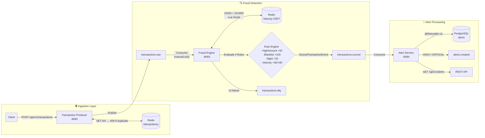

# 🛡️ Transaction Shield — Real-Time Fraud Detection Engine

<div align="center">


**A production-grade, event-driven fraud detection system built on Apache Kafka.**  
Processes financial transactions in real-time using a pluggable Rule Engine,  
Redis-powered velocity checks, and distributed idempotency guarantees.

[Architecture](#-system-architecture) · [Features](#-key-technical-features) · [Getting Started](#-getting-started) · [Testing](#-testing-strategy)

</div>

---

## 🎯 Why This Project?

Most fraud detection tutorials stop at "publish to Kafka and log it." This project goes further — it answers the questions that senior engineers actually care about:

- **What happens when the same transaction arrives twice?** → Two-layer idempotency (Redis + DB)
- **How do you detect a user making 10 transactions in 60 seconds?** → Redis ZSET Sliding Window with atomic Lua Script
- **How do you add a new fraud rule without touching existing code?** → Strategy Pattern; one new `@Component` class, zero other changes
- **What happens when Kafka delivery fails?** → Exponential backoff + Dead Letter Queue

---

## 🏗️ System Architecture

### Data Flow



### Module Responsibilities

| Module | Port | Responsibility |
|---|---|---|
| `transaction-producer` | 8082 | REST API → Redis idempotency check → `transactions.raw` publish |
| `fraud-engine` | 8083 | Consume → Rule Engine → Score → `transactions.scored` publish |
| `alert-service` | 8084 | Consume → PostgreSQL persist → `alerts.created` (HIGH/CRITICAL only) |
| `common` | — | Shared Kafka event records (`TransactionEvent`, `ScoredTransactionEvent`, `AlertCreatedEvent`) |

---

## ✨ Key Technical Features

### 1. 🔁 Distributed Idempotency (Two-Layer Protection)

The system prevents duplicate processing at two independent layers:

**Layer 1 — Redis (Producer):**  
On every `POST /api/v1/transactions`, the producer issues an atomic `SET NX EX` command:

```
SET idempotency:transaction:<idempotencyKey> "PROCESSING" NX EX 86400
```

- Returns `true` → first time seen, proceed to Kafka publish
- Returns `false` → duplicate detected, return `HTTP 409 Conflict`
- **Compensation:** if Kafka publish fails, `DEL` the Redis key so the client can safely retry

**Layer 2 — PostgreSQL (Alert Service):**  
The `alerts` table has a `UNIQUE` constraint on `transaction_id`. If Kafka redelivers the same scored event (at-least-once guarantee), the `INSERT` raises `DataIntegrityViolationException`, which is explicitly **excluded** from `@Retryable` — it's caught silently and the duplicate is discarded.

**Why two layers?**  
Redis is fast but volatile (TTL-based). The DB constraint provides crash-safe, durable deduplication that survives Redis restarts.

---

### 2. ⚡ Velocity Check — Redis Sorted Set Sliding Window

The most sophisticated rule: detecting users who make too many transactions in a short window.

**Why ZSET instead of a simple counter?**

```
Simple INCR + TTL (Fixed Window) — WRONG:
  [00:00–01:00] → 5 transactions, counter resets at 01:00
  Attack: 5 tx at 00:59 + 5 tx at 01:01 = 10 tx detected as 5+5 ✗

ZSET Sliding Window — CORRECT:
  score = epoch_ms, member = transactionId
  At any moment: count entries where score > (now - 60_000ms)
  Attack: 5 tx at 00:59 + 5 tx at 01:01 = 10 tx in window at 01:01 ✓
```

**Why Lua Script instead of Redis Pipeline?**

```
Pipeline (not atomic):
  Thread A: ZADD ...              ──┐
  Thread B: ZADD ...              ──┤ interleaved — race condition
  Thread A: ZREMRANGEBYSCORE ...  ──┘ Thread B's entry visible → wrong count

Lua Script (atomic):
  Redis executes Lua in a single-threaded block.
  ZADD → ZREMRANGEBYSCORE → ZCARD → EXPIRE  (one indivisible unit)
  Also uses EVALSHA: script uploaded once, called by SHA1 hash → 1 RTT
```

The Lua script (loaded at startup via `DefaultRedisScript`):
```lua
redis.call('ZADD',            key, nowMs, transactionId)
redis.call('ZREMRANGEBYSCORE', key, '-inf', nowMs - windowMs)
local count = redis.call('ZCARD', key)
redis.call('EXPIRE', key, ttlSeconds)
return count
```

**Score tiers (configurable via `application.yml`):**

| Window Count | Score Added | Risk Contribution |
|---|---|---|
| ≤ 3 | +0 | Normal behaviour |
| 4 – 5 | +40 | Suspicious velocity |
| > 5 | +80 | High-confidence fraud |

---

### 3. 🧩 Strategy Pattern Rule Engine

Every fraud rule implements a single interface:

```java
public interface FraudRule {
    RuleResult evaluate(TransactionEvent event);
    String getRuleCode();
}
```

Spring auto-collects **all** `@Component` implementations into `List<FraudRule>`:

```java
@Service
public class FraudRuleEngine {
    private final List<FraudRule> rules; // Spring injects ALL FraudRule beans
    // ...
}
```

**Adding a new rule = one new class. Zero other changes.**

```java
@Component
@Order(5)
public class NewDeviceRule implements FraudRule {
    public RuleResult evaluate(TransactionEvent event) { /* ... */ }
    public String getRuleCode() { return "NEW_DEVICE"; }
}
```

This is the **Open/Closed Principle** in production: open for extension, closed for modification.

| Rule | Trigger | Score |
|---|---|---|
| `HighAmountRule` | amount > 10,000 | +50 |
| `BlacklistedCountryRule` | country in [RU, KP, IR, SY, CU] | +100 |
| `NightTransactionRule` | 00:00–05:00 UTC | +20 |
| `VelocityRule` | > 3 tx / min → +40, > 5 tx / min → +80 | +40 / +80 |

Scores are summed and **capped at 100**. Risk level is derived:

```
0–29  → LOW      30–59 → MEDIUM
60–89 → HIGH     90–100 → CRITICAL
```

---

### 4. 🔒 Resilience & Fault Tolerance

**Kafka Dead Letter Queue (fraud-engine + alert-service):**

```
Message consumed
    │
    ▼ (attempt 1 fails)
ExponentialBackOff  →  1s → 2s → 4s  (3 total attempts)
    │
    ▼ (all attempts exhausted)
DeadLetterPublishingRecoverer
    │  preserves original headers: exception class, message, topic, partition, offset
    ▼
transactions.dlq  ←  DlqConsumer monitors and logs for human investigation
```

`DeserializationException` (malformed JSON) bypasses retries entirely — retrying a broken payload three times wastes resources and adds latency.

**Spring @Retryable (alert-service — database layer):**

```java
@Retryable(
    retryFor   = DataAccessException.class,
    noRetryFor = DataIntegrityViolationException.class, // duplicate → skip immediately
    maxAttempts = 3,
    backoff     = @Backoff(delay = 500, multiplier = 2.0, maxDelay = 4_000)
)
@Transactional
public Alert saveAlert(ScoredTransactionEvent event) { ... }
```

Two retry layers, independent of each other:
- **Service-level** `@Retryable`: handles transient DB errors (connection pool exhaustion, deadlocks)
- **Kafka-level** `DefaultErrorHandler`: handles persistent failures after service retries are exhausted

---

## 🛠️ Tech Stack

| Category | Technology | Version | Rationale |
|---|---|---|---|
| Language | Java | 21 | Records for immutable events, pattern matching |
| Framework | Spring Boot | 3.4.1 | Production autoconfiguration, Kafka integration |
| Messaging | Apache Kafka (Confluent) | 7.7.0 | Durable, ordered, replay-capable event stream |
| Cache / State | Redis | 7.4 | SET NX idempotency, ZSET sliding window |
| Database | PostgreSQL | 16 | Alert persistence, UNIQUE constraint deduplication |
| Serialization | Jackson (JSON) | 2.18 | Schema-less, human-readable Kafka payloads |
| Resilience | Spring Retry | 2.x | `@Retryable` + `@Recover` for DB fault tolerance |
| Testing | Testcontainers | 1.20 | Real containers, zero mocking |
| Async assertions | Awaitility | 4.x | Fluent async test assertions |
| Observability | Spring Actuator | — | `/health`, `/metrics` endpoints |
| Build | Maven (multi-module) | 3.9 | Enforced module boundaries |

---

## 🚀 Getting Started

### Prerequisites

- Docker & Docker Compose
- Java 21+ (for local builds)
- Maven 3.9+ (for local builds)

### Quick Start

**1. Clone the repository**
```bash
git clone https://github.com/your-username/transaction-shield-kafka.git
cd transaction-shield-kafka
```

**2. Start all infrastructure**
```bash
docker compose up -d
```

This starts: Zookeeper, Kafka, Schema Registry, PostgreSQL, Redis, and Kafka UI.  
The `kafka-init` service automatically creates all required topics on first run.

**3. Verify everything is healthy**
```bash
docker compose ps
# All services should be "healthy" or "running"

# Confirm topics were created
docker logs ts-kafka-init
```

**4. Build and run each service**
```bash
# Terminal 1 — Transaction Producer
cd transaction-producer && mvn spring-boot:run

# Terminal 2 — Fraud Engine
cd fraud-engine && mvn spring-boot:run

# Terminal 3 — Alert Service
cd alert-service && mvn spring-boot:run
```

### 🧪 Send Your First Transaction

```bash
curl -X POST http://localhost:8082/api/v1/transactions \
  -H "Content-Type: application/json" \
  -d '{
    "idempotencyKey": "txn-demo-001",
    "userId":         "user-42",
    "amount":         15000.00,
    "currency":       "USD",
    "country":        "RU",
    "deviceFingerprint": "fp-abc-123"
  }'
```

**Expected response (HTTP 202):**
```json
{
  "transactionId": "f3c9b1a2-...",
  "idempotencyKey": "txn-demo-001",
  "status": "ACCEPTED",
  "acceptedAt": "2026-05-14T10:30:00Z"
}
```

**Retry with the same `idempotencyKey` → HTTP 409:**
```json
{
  "status": 409,
  "error": "Conflict",
  "message": "Duplicate transaction detected for idempotency key: txn-demo-001"
}
```

### 📋 Query Alerts

```bash
# All alerts, newest first
curl http://localhost:8084/api/v1/alerts

# Filter by risk level
curl "http://localhost:8084/api/v1/alerts?riskLevel=CRITICAL&page=0&size=10"
```

### 🖥️ Kafka UI

Open [http://localhost:8080](http://localhost:8080) to browse topics, consumer groups, and messages in real time.

### 🔧 Service Ports

| Service | Port |
|---|---|
| Transaction Producer REST API | `8082` |
| Fraud Engine Actuator | `8083/actuator` |
| Alert Service REST API | `8084` |
| Kafka UI | `8080` |
| Schema Registry | `8081` |
| Kafka Broker (external) | `9092` |
| PostgreSQL | `5432` |
| Redis | `6379` |

---

## 🧪 Testing Strategy

### Why Real Containers Instead of Mocks?

Integration tests in this project use **Testcontainers** — real Docker containers for Kafka, Redis, and PostgreSQL. This is a deliberate architectural choice:

```
Mock-based tests verify:   "Does my code call the right methods?"
Container-based tests verify: "Does my system BEHAVE correctly end-to-end?"
```

Specific issues mocks cannot catch that Testcontainers catches:
- Redis `SET NX` semantics differ from a mock's boolean return
- Kafka offset commit ordering with `MANUAL_IMMEDIATE` ack mode
- `DataIntegrityViolationException` from a real PostgreSQL UNIQUE constraint
- Lua script SHA1 caching (`EVALSHA`) and Redis script execution model

### Test Architecture

```
AbstractIntegrationTest
├── static KAFKA    (KafkaContainer 7.7.0)  ─┐
├── static POSTGRES (PostgreSQLContainer 16) ├── Startables.deepStart() → parallel startup
├── static REDIS    (GenericContainer 7.4)  ─┘
│
├── @DynamicPropertySource → injects dynamic ports into Spring context
└── @Import(TestKafkaConfig.class)
      ├── rawEventTemplate              (publishes TransactionEvent to transactions.raw)
      ├── testKafkaListenerFactory      (separate consumer factory for ScoredTransactionEvent)
      └── NewTopic beans                (auto-creates topics via KafkaAdmin)

ScoredEventCollector (@Component in test source)
└── BlockingQueue<ScoredTransactionEvent>
    └── poll(Duration timeout) → thread-safe async event capture
```

### Test Scenarios

**`FraudEngineIntegrationTest`** — 5 end-to-end scenarios:
```
✅ HighAmount (15,000 USD)          → HIGH_AMOUNT triggered, score=50, MEDIUM
✅ Blacklisted country (RU)         → BLACKLISTED_COUNTRY, score=100, CRITICAL
✅ Night transaction (02:30 UTC)    → SUSPICIOUS_HOUR, score=20, LOW
✅ Multiple rules (15K USD + RU)    → rawScore=150, fraudScore=100 (capped), CRITICAL
✅ Clean transaction (500 USD, US)  → no rules triggered, score=0, LOW
```

**`VelocityRuleIntegrationTest`** — sliding window escalation:
```
Sequential publish-wait loop (guarantees Redis is updated between sends):

tx1 → scored1  count=1  VELOCITY not triggered  ✅
tx2 → scored2  count=2  VELOCITY not triggered  ✅
tx3 → scored3  count=3  VELOCITY not triggered  ✅ (threshold is EXCEEDED, not MET)
tx4 → scored4  count=4  VELOCITY +40 triggered  ✅
tx5 → scored5  count=5  VELOCITY +40 triggered  ✅
tx6 → scored6  count=6  VELOCITY +80 triggered  ✅  riskLevel: HIGH/CRITICAL
```

**`IdempotencyIntegrationTest`** — duplicate rejection:
```
Send same transactionId twice:
  first  → processed → scored event in queue ✅
  second → Redis SET NX returns false → skipped → queue remains empty ✅
  
Send same transactionId three times:
  first  → scored ✅
  second → null (timeout) ✅
  third  → null (timeout) ✅
```

### Running the Tests

```bash
# Run all integration tests (requires Docker)
cd fraud-engine
mvn test -Dtest="*IntegrationTest"

# Run a specific class
mvn test -Dtest="VelocityRuleIntegrationTest"

# Run all tests with verbose output
mvn test -Dtest="*IntegrationTest" -pl fraud-engine
```

---

## 📁 Project Structure

```
transaction-shield-kafka/
│
├── common/                              # Shared library — no Spring Boot entrypoint
│   └── src/main/java/com/transactionshield/common/
│       ├── event/
│       │   ├── TransactionEvent.java        # Kafka: transactions.raw
│       │   ├── ScoredTransactionEvent.java  # Kafka: transactions.scored
│       │   └── AlertCreatedEvent.java       # Kafka: alerts.created
│       ├── dto/
│       │   ├── TransactionRequest.java      # REST input (Bean Validation)
│       │   └── TransactionResponse.java     # REST output
│       └── enums/
│           ├── RiskLevel.java               # LOW / MEDIUM / HIGH / CRITICAL
│           └── TransactionStatus.java
│
├── transaction-producer/                # :8082
│   └── src/main/java/.../producer/
│       ├── controller/TransactionController.java
│       ├── service/
│       │   ├── TransactionProducerService.java  # Orchestrates idempotency + Kafka publish
│       │   └── IdempotencyService.java           # Redis SET NX guard
│       └── config/
│           ├── KafkaProducerConfig.java          # enable.idempotence=true, acks=all
│           └── RedisConfig.java
│
├── fraud-engine/                        # :8083
│   └── src/main/java/.../engine/
│       ├── rule/
│       │   ├── FraudRule.java                   # Strategy interface
│       │   ├── RuleResult.java                  # Immutable result record
│       │   └── impl/
│       │       ├── HighAmountRule.java           # @Order(1)
│       │       ├── BlacklistedCountryRule.java   # @Order(2)
│       │       ├── NightTransactionRule.java     # @Order(3)
│       │       └── VelocityRule.java             # @Order(4) — Redis ZSET
│       ├── scoring/
│       │   ├── FraudRuleEngine.java             # Aggregates List<FraudRule>
│       │   └── ScoringResult.java
│       ├── service/
│       │   ├── FraudEngineService.java          # Idempotency + Rules + Publish
│       │   ├── ScoringIdempotencyService.java   # Redis SET NX on transactionId
│       │   └── VelocityCheckService.java        # Lua script execution
│       ├── consumer/
│       │   ├── TransactionEventConsumer.java    # @KafkaListener, manual ack
│       │   └── DlqConsumer.java                 # DLQ monitoring
│       └── resources/scripts/
│           └── velocity_check.lua               # Atomic ZADD+ZREMRANGE+ZCARD+EXPIRE
│
├── alert-service/                       # :8084
│   └── src/main/java/.../alert/
│       ├── entity/Alert.java                    # JPA entity, UNIQUE(transaction_id)
│       ├── repository/AlertRepository.java      # findAlertsFiltered JPQL
│       ├── service/AlertService.java            # @Retryable + @Transactional
│       ├── consumer/ScoredTransactionConsumer.java
│       ├── producer/AlertEventProducer.java     # alerts.created publisher
│       └── controller/AlertController.java      # GET /api/v1/alerts
│
├── infrastructure/
│   └── postgres/init.sql                # Schema: transactions, alerts, fraud_rules, idempotency_log
│
└── docker-compose.yml                   # Kafka, Zookeeper, Schema Registry, PostgreSQL, Redis, Kafka UI
```

---

## 📄 License

This project is licensed under the MIT License.

---

<div align="center">
Built with ☕ Java 21 · 🌿 Spring Boot · 📨 Apache Kafka · ⚡ Redis · 🐘 PostgreSQL
</div>
