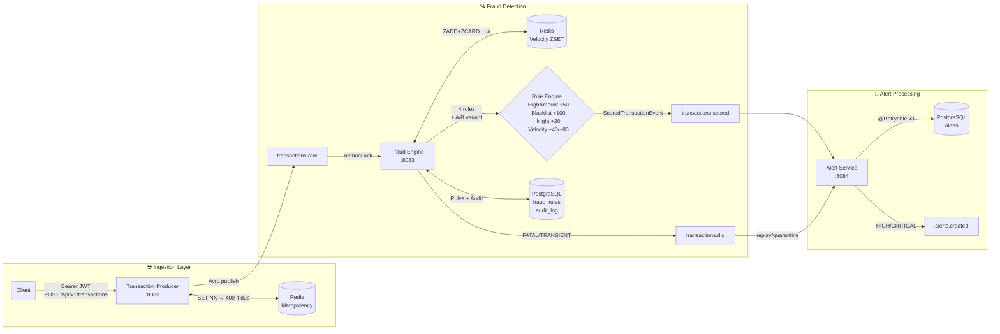

# 🛡️ Transaction Shield — Real-Time Fraud Detection Engine

<div align="center">


[](https://github.com/mithrandir3010/transaction-shield-kafka/actions/workflows/ci.yml)
[](https://github.com/mithrandir3010/transaction-shield-kafka/releases)

**A production-grade, event-driven fraud detection system built on Apache Kafka.**  
Processes financial transactions in real-time using a pluggable Rule Engine,  
Redis-powered velocity checks, and distributed idempotency guarantees.

[Architecture](#️-system-architecture) · [Features](#-key-technical-features) · [Getting Started](#-getting-started) · [Testing](#-testing-strategy) · [Operations](#️-operations)

</div>

---

## 🎯 Why This Project?

Most fraud detection tutorials stop at "publish to Kafka and log it." This project goes further — it answers the questions that senior engineers actually care about:

- **What happens when the same transaction arrives twice?** → Two-layer idempotency (Redis SET NX + DB UNIQUE)
- **How do you detect a user making 10 transactions in 60 seconds?** → Redis ZSET Sliding Window with atomic Lua Script
- **How do you add a new fraud rule without touching existing code?** → Strategy Pattern; one new `@Component`, zero other changes
- **What happens when Kafka delivery fails?** → Error taxonomy (FATAL/NON_RETRYABLE/TRANSIENT), exponential backoff, DLQ, replay API
- **How do you prevent a schema change from silently breaking consumers?** → Avro + Schema Registry BACKWARD compatibility enforced at CI time
- **How do you secure internal APIs without an external identity provider?** → HS256 JWT resource server (external) + API key filter (internal)
- **How do you make sure your system survives Redis or Postgres going down?** → Chaos tests with Testcontainers pause/stop, cached rule fallback
- **How do you measure whether the system can handle 500 TPS?** → K6 load tests with p95/p99 SLO thresholds

---

## 🏗️ System Architecture

### Data Flow


```mermaid
flowchart LR
    subgraph Ingestion ["🌐 Ingestion Layer"]
        CLIENT(Client) -->|"Bearer JWT\nPOST /api/v1/transactions"| PROD["Transaction Producer\n:8082"]
        PROD <-->|"SET NX → 409 if dup"| R1[("Redis\nIdempotency")]
    end

    subgraph Detection ["🔍 Fraud Detection"]
        PROD -->|"Avro publish"| T1[transactions.raw]
        T1 -->|"manual ack"| ENG["Fraud Engine\n:8083"]
        ENG <-->|"ZADD+ZCARD Lua"| R2[("Redis\nVelocity ZSET")]
        ENG -->|"4 rules\n± A/B variant"| RULES{"Rule Engine\n· HighAmount +50\n· Blacklist +100\n· Night +20\n· Velocity +40/+80"}
        RULES -->|"ScoredTransactionEvent"| T2[transactions.scored]
        ENG -->|"FATAL/TRANSIENT"| DLQ[transactions.dlq]
        ENG <-->|"Rules + Audit"| PG2[("PostgreSQL\nfraud_rules\naudit_log")]
    end

    subgraph Alerting ["🚨 Alert Processing"]
        T2 --> AS["Alert Service\n:8084"]
        AS -->|"@Retryable x3"| PG[("PostgreSQL\nalerts")]
        AS -->|"HIGH/CRITICAL"| T3[alerts.created]
        DLQ -->|"replay/quarantine"| AS
    end
```

### Module Responsibilities

| Module | Port | Responsibility |
|---|---|---|
| `transaction-producer` | 8082 | REST API (JWT auth) → Redis idempotency → `transactions.raw` |
| `fraud-engine` | 8083 | Consume → DB-backed Rule Engine + A/B routing → `transactions.scored` |
| `alert-service` | 8084 | Consume → PostgreSQL persist → DLQ replay → alerts REST API |
| `common` | — | Avro schemas, `AvroMapper`, domain records, DLQ headers, DTOs |

---

## ✨ Key Technical Features

### 1. 🔁 Distributed Idempotency (Two-Layer Protection)

**Layer 1 — Redis (Producer):**
```
SET idempotency:transaction:<key> "PROCESSING" NX EX 86400
→ true  = new request → proceed
→ false = duplicate   → HTTP 409
→ on Kafka fail: DEL key → safe client retry
```

**Layer 2 — PostgreSQL (Alert Service):**  
`alerts` table has `UNIQUE(transaction_id)`. A Kafka redeliver raises `DataIntegrityViolationException`, which is excluded from `@Retryable` and silently discarded.

---

### 2. ⚡ Velocity Check — Redis ZSET Sliding Window

A fixed-window counter resets at boundary moments; a ZSET sliding window doesn't:

```
Fixed window attack: 5 tx at 00:59 + 5 tx at 01:01 = seen as 5 ✗
Sliding window:      both windows overlap at 01:01   = seen as 10 ✓
```

Atomic Lua script (ZADD → ZREMRANGEBYSCORE → ZCARD → EXPIRE) — no race conditions, single round-trip via `EVALSHA`:

```lua
redis.call('ZADD',             key, nowMs, transactionId)
redis.call('ZREMRANGEBYSCORE', key, '-inf', nowMs - windowMs)
local count = redis.call('ZCARD', key)
redis.call('EXPIRE', key, ttlSeconds)
return count
```

---

### 3. 🧩 Strategy Pattern Rule Engine with DB-Backed Config

Every rule is a `@Component` implementing `FraudRule`. Spring auto-collects them all:

```java
@Service
public class FraudRuleEngine {
    private final List<FraudRule> rules; // Spring injects ALL FraudRule beans
}
```

**Adding a new rule = one new class, zero other changes.** Rule weights and parameters live in PostgreSQL and are refreshed every 5 minutes without a restart.

| Rule | Trigger | Score |
|---|---|---|
| `HighAmountRule` | amount > 10,000 | +50 |
| `BlacklistedCountryRule` | country in [RU, KP, IR, SY, CU] | +100 |
| `NightTransactionRule` | 00:00–05:00 UTC | +20 |
| `VelocityRule` | > 3 tx/min → +40, > 5 tx/min → +80 | +40/+80 |

Scores summed and capped at 100: `0–29 LOW` · `30–59 MEDIUM` · `60–89 HIGH` · `90–100 CRITICAL`

**A/B Experiment Routing:**  
Each transaction is deterministically routed to `STABLE` or `EXPERIMENT` rule variant via hash of `transactionId`. Activation/deactivation via REST API takes effect in < 5 seconds.

---

### 4. 📨 DLQ Taxonomy and Replay

Every dead-lettered message carries error classification headers:

| Category | Cause | Automatic action |
|---|---|---|
| `FATAL` | `DeserializationException` — corrupt payload | Quarantined immediately |
| `NON_RETRYABLE` | `DataIntegrityViolationException` — duplicate | Skipped on replay |
| `TRANSIENT` | DB/network blip | Replayed after infra recovers |

**Replay API (alert-service):**
```bash
# Dry-run first
curl -X POST http://localhost:8084/api/v1/dlq/replay \
  -H "X-Internal-Api-Key: $INTERNAL_API_KEY" \
  -d '{"errorCategoryFilter":"TRANSIENT","maxMessages":100,"dryRun":true}'

# Live replay
curl -X POST http://localhost:8084/api/v1/dlq/replay \
  -H "X-Internal-Api-Key: $INTERNAL_API_KEY" \
  -d '{"errorCategoryFilter":"TRANSIENT","maxMessages":100,"dryRun":false}'
```

---

### 5. 🔒 Security

**External API (transaction-producer):** HS256 JWT resource server. Every `POST /api/v1/transactions` requires a `Bearer` token. Key configured via `JWT_SECRET_KEY` env var (min 32 bytes for HS256).

**Internal APIs (fraud-engine, alert-service):** `X-Internal-Api-Key` header filter. Key configured via `INTERNAL_API_KEY` env var.

**PII masking:** `userId` is masked before it enters any log sink (`us***01` pattern). `logback-spring.xml` adds a `MaskingJsonGeneratorDecorator` safety net for card-number patterns.

**Secret management:** All credentials are externalized via `${ENV_VAR:local-default}`. See `.env.example` for the full list. Production: AWS Secrets Manager or HashiCorp Vault via `spring.config.import`.

---

### 6. 📐 Schema Governance — Avro + Schema Registry

All Kafka events use Apache Avro with BACKWARD compatibility enforced:

```
✅ Add optional field (default=null) → safe
❌ Add required field (no default)   → REJECTED by Registry at publish time
❌ Change field type string→int      → REJECTED by Registry at publish time
```

`SchemaCompatibilityTest` (no Docker, milliseconds) covers six scenarios and runs on every CI push, catching breaking changes before they reach any service.

---

### 7. 🗄️ Database Migrations — Flyway

Each service maintains its own Flyway history table. Schema is version-controlled, not ad-hoc:

| Service | Migrations |
|---|---|
| `fraud-engine` | V1 base schema, V2 rule seeds, V3 A/B config, V4 type widening |
| `alert-service` | V1 alerts table, V2 score type fix, V3 quarantine table |

---

## 🛠️ Tech Stack

| Category | Technology | Version |
|---|---|---|
| Language | Java | 21 |
| Framework | Spring Boot | 3.4.1 |
| Messaging | Apache Kafka (Confluent) | 7.7.0 |
| Serialization | Apache Avro | 1.11.3 |
| Schema Registry | Confluent Schema Registry | 7.7.0 |
| Cache / State | Redis | 7.4 |
| Database | PostgreSQL | 16 |
| DB Migrations | Flyway | 10.x |
| Security | Spring Security OAuth2 Resource Server | 6.x |
| Resilience | Spring Retry, DefaultErrorHandler | 2.x / 3.x |
| Observability | Micrometer + Prometheus + OpenTelemetry + Jaeger | — |
| Testing | Testcontainers | 1.20 |
| Load Testing | K6 | — |
| Build | Maven multi-module | 3.9 |
| CI/CD | GitHub Actions | — |
| Containers | Docker Compose (local) | — |

---

## 🚀 Getting Started

### Prerequisites

- Docker & Docker Compose
- Java 21+, Maven 3.9+

### Quick Start

```bash
# 1. Clone
git clone https://github.com/mithrandir3010/transaction-shield-kafka.git
cd transaction-shield-kafka

# 2. Copy env template
cp .env.example .env   # edit secrets as needed for local dev

# 3. Start infrastructure
docker compose up -d

# 4. Run services (3 terminals)
cd transaction-producer && mvn spring-boot:run
cd fraud-engine         && mvn spring-boot:run
cd alert-service        && mvn spring-boot:run
```

### Generate a Test JWT

The API requires a Bearer token. Generate one with the dev secret:

```bash
# Python (PyJWT)
pip install pyjwt cryptography
python3 -c "
import jwt, time
print(jwt.encode({'sub':'demo','exp':int(time.time())+86400},
  'dev-jwt-secret-changeme-minimum-32-bytes!!', algorithm='HS256'))
"

# Node.js
node -e "
const {createHmac}=require('crypto');
const h=Buffer.from(JSON.stringify({alg:'HS256',typ:'JWT'})).toString('base64url');
const p=Buffer.from(JSON.stringify({sub:'demo',exp:Math.floor(Date.now()/1000)+86400})).toString('base64url');
const s=createHmac('sha256','dev-jwt-secret-changeme-minimum-32-bytes!!').update(h+'.'+p).digest('base64url');
console.log(h+'.'+p+'.'+s);
"
```

> In production set `JWT_SECRET_KEY` to a 32-byte random secret: `openssl rand -base64 32`

### Send a Transaction

```bash
TOKEN="<paste JWT here>"

curl -X POST http://localhost:8082/api/v1/transactions \
  -H "Authorization: Bearer $TOKEN" \
  -H "Content-Type: application/json" \
  -d '{
    "idempotencyKey": "txn-demo-001",
    "userId":         "user-42",
    "amount":         15000.00,
    "currency":       "USD",
    "country":        "RU",
    "deviceFingerprint": "fp-abc-123"
  }'
```

**202 Accepted:**
```json
{"transactionId":"f3c9b1a2-...","idempotencyKey":"txn-demo-001","status":"ACCEPTED"}
```

**Same key again → 409 Conflict:**
```json
{"status":409,"error":"Conflict","message":"Duplicate transaction detected..."}
```

### Query Alerts

```bash
APIKEY="internal-dev-key-change-in-production"

curl -H "X-Internal-Api-Key: $APIKEY" \
  "http://localhost:8084/api/v1/alerts?riskLevel=CRITICAL"
```

### Service Ports

| Service | Port |
|---|---|
| Transaction Producer REST API | `8082` |
| Fraud Engine (actuator + rules API) | `8083` |
| Alert Service REST API | `8084` |
| Kafka UI | `8080` |
| Schema Registry | `8081` |
| Prometheus | `9090` |
| Grafana | `3000` (admin/admin) |
| Jaeger UI | `16686` |

---

## 🧪 Testing Strategy

### Test Pyramid

```
                    ┌───────────────┐
                    │  Chaos Tests  │  @Tag("chaos") — excluded by default
                    │  3 classes    │  mvn test -Dgroups=chaos
                    └───────────────┘
               ┌─────────────────────────┐
               │   Integration Tests     │  Testcontainers — real Kafka/PG/Redis
               │   ~50 @Test methods     │  mvn verify
               └─────────────────────────┘
          ┌──────────────────────────────────┐
          │   Unit + Contract Tests          │  No Docker, < 10s total
          │   ~50 @Test methods              │  mvn test
          └──────────────────────────────────┘
```

### Why Real Containers?

```
Mock-based tests: "Does my code call the right methods?"
Container tests:  "Does the system BEHAVE correctly end-to-end?"
```

Specific issues only Testcontainers catches:
- Redis `SET NX` semantics and `EVALSHA` Lua caching
- Kafka `MANUAL_IMMEDIATE` ack ordering
- PostgreSQL `UNIQUE` constraint raising `DataIntegrityViolationException`
- Avro schema ID round-trip (register → serialize → deserialize by ID)

### Chaos Resilience Tests

| Test | Scenario | Expected |
|---|---|---|
| `KafkaDownChaosTest` | Broker paused mid-operation | `POST /transactions` returns 503; 202 after recovery |
| `RedisDownChaosTest` | Redis paused | Idempotency throws → 503; key reusable after recovery (was never set) |
| `PostgresDownResilienceTest` | DB paused after rules loaded | Fraud engine scores using cached rules; audit log fails silently; recovery resumes refresh |

Run chaos tests explicitly (Docker required):
```bash
mvn test -Dgroups=chaos
```

### Load Tests (K6)

```bash
# Requires: brew install k6 + docker compose up -d + all 3 services running

./load-tests/k6/run.sh baseline   # 50 VU, 3min — SLO: p95<100ms, p99<200ms, err<0.1%
./load-tests/k6/run.sh stress     # ramp to 500 VU — SLO: p95<250ms, p99<500ms
./load-tests/k6/run.sh spike      # 15× burst + recovery p99 tracking
./load-tests/k6/run.sh soak       # 30 VU, 30min — memory leak / pool exhaustion detection
```

### Key Integration Test Scenarios

**`FraudEngineIntegrationTest`** (5 scenarios):
```
✅ HighAmount (15K USD)           → HIGH_AMOUNT triggered, score=50
✅ Blacklisted country (RU)        → BLACKLISTED_COUNTRY, score=100, CRITICAL
✅ Night transaction (02:30 UTC)   → SUSPICIOUS_HOUR, score=20
✅ Compound (15K + RU)             → rawScore=150, capped to 100, CRITICAL
✅ Clean (500 USD, US, daytime)    → score=0, LOW
```

**`VelocityRuleIntegrationTest`** (sliding window escalation):
```
tx1–tx3 → no flag (threshold EXCEEDED, not met)
tx4–tx5 → VELOCITY +40
tx6+    → VELOCITY +80, risk: HIGH/CRITICAL
```

**`SchemaCompatibilityTest`** (no Docker, milliseconds):
```
✅ Add optional field              → BACKWARD compatible
❌ Add required field (no default) → REJECTED
❌ Change type string→int          → REJECTED
```

### Running Tests

```bash
mvn test                              # unit + contract (no Docker needed)
mvn verify                            # all tests including integration
mvn test -Dgroups=chaos               # chaos only (Docker required)
mvn test -DskipGroups=                # everything including chaos
mvn test -pl common -Dtest="SchemaCompatibilityTest"
```

---

## 🔄 CI/CD Pipeline

```
push / pull_request → main
         │
         ▼
      [Build]  compile-only fast-fail
         │
    ┌────┴────┐
    │         │
[Unit Tests] [Contract Tests]  ← parallel
(no Docker)  (Avro compat)
    │         │
    └────┬────┘
         │
    ┌────┴──────────────┐
    │                   │
[Integration Tests]  [Security Scan]  ← parallel
(Testcontainers)     (OWASP + Trivy FS → SARIF)
    │
    ▼
[Image Scan × 3]   docker build + Trivy → GitHub Security tab
```

**Branch protection (main):** all 8 checks required, 1 PR review, linear history, no force push.

**Release (on merge to main):** `release-please` opens a Release PR when `feat:` or `fix:` commits land.  
Merge the Release PR → `pom.xml` bumped, `CHANGELOG.md` updated, `vX.Y.Z` tag + GitHub Release created automatically.

---

## 🛠️ Operations

| Document | Contents |
|---|---|
| [DLQ Spike Runbook](docs/runbooks/DLQ_SPIKE.md) | Triage by error category, replay commands, recovery validation |
| [Redis Down Runbook](docs/runbooks/REDIS_DOWN.md) | OOM/crash/network diagnosis, restart, failover, duplicate risk |
| [Schema Mismatch Runbook](docs/runbooks/SCHEMA_MISMATCH.md) | Incompatibility diagnosis, rollback, two-phase deploy protocol |
| [Consumer Lag Runbook](docs/runbooks/CONSUMER_LAG.md) | DB/GC/traffic analysis, scale-out path, partition tuning guide |
| [Alert Thresholds](docs/ALERTS.md) | 15 Prometheus rules, Alertmanager routing (PagerDuty/Slack), SLO table |
| [On-Call Guide](docs/ONCALL.md) | Decision tree, shift checklist, incident timeline, useful commands |
| [RTO/RPO & Rollback](docs/INCIDENT_RESPONSE.md) | Offset reset, migration rollback, rule disable, recovery checklist |

**RTO/RPO summary:**

| Service | RPO | RTO |
|---|---|---|
| transaction-producer | 0 | 5 min |
| fraud-engine | 0 (Kafka retains events) | 15 min |
| alert-service | 0 (Kafka retains events) | 30 min |

---

## 📁 Project Structure

```
transaction-shield-kafka/
├── common/                   # Shared library — Avro schemas, domain records, DLQ headers
├── transaction-producer/     # :8082 — REST (JWT) → Redis idempotency → Kafka
│   └── Dockerfile
├── fraud-engine/             # :8083 — Rule Engine, A/B routing, velocity check, DLQ
│   └── Dockerfile
├── alert-service/            # :8084 — Alert persist, DLQ replay/quarantine, REST API
│   └── Dockerfile
├── load-tests/k6/            # K6 load test scenarios (baseline/stress/spike/soak)
├── docs/
│   ├── runbooks/             # DLQ_SPIKE, REDIS_DOWN, SCHEMA_MISMATCH, CONSUMER_LAG
│   ├── ALERTS.md             # Prometheus rules + Alertmanager config
│   ├── ONCALL.md             # On-call guide and checklists
│   └── INCIDENT_RESPONSE.md # RTO/RPO, rollback procedures
├── monitoring/
│   ├── prometheus.yml
│   ├── prometheus-alerts.yml # 15 alerting rules
│   └── grafana/              # Pre-provisioned dashboard (11 panels)
├── .github/
│   ├── workflows/
│   │   ├── ci.yml            # 6-stage pipeline: build → unit/contract → integration/security → image
│   │   └── release.yml       # release-please: semver + CHANGELOG + GitHub Release
│   ├── release-please-config.json
│   ├── owasp-suppressions.xml
│   └── scripts/setup-branch-protection.sh
├── .env.example              # All required env vars with documentation
├── .trivyignore              # CVE suppression policy
├── CHANGELOG.md              # Auto-generated by release-please
└── docker-compose.yml        # Full local stack: Kafka, PG, Redis, Prometheus, Grafana, Jaeger
```

---

## 📄 License

MIT

---

<div align="center">
Java 21 · Spring Boot 3.4 · Apache Kafka · Redis · PostgreSQL · Testcontainers
</div>
